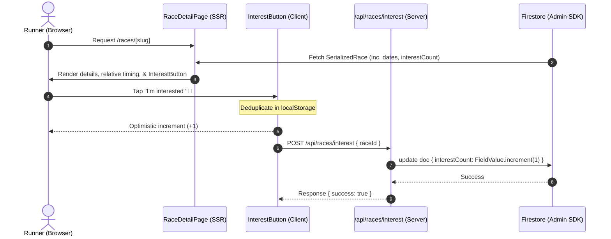

# feat: Add registration urgency engine and interest signals (v1)

This plan details the implementation of **Registration Urgency (v1)** for *Find Me a Race*. It integrates our curated date-and-link dataset into Firestore, introduces server-side relative date calculation, renders clear urgency banners/badges near the registration CTA, and implements an anonymous "I'm interested" / 🔔 demand-capture button with client-side deduplication.

---

## Problem Frame & Scope

### Problem Frame
Currently, the app lacks any action-driving visibility into registration timelines. Runners browsing upcoming races cannot see whether registration closes in 3 days or 6 months. For races that are not yet open, they have no mechanism to express interest or act. This passive experience leads to missed conversions and lower runner engagement.

### Scope Boundaries
* **In Scope (v1)**:
  * Extend `SerializedRace` and `Race` models with new fields (`sourceUrl`, `notes`, `lastVerified`, `interestCount`).
  * Run a targeted TypeScript script (`scripts/update-curated-dates.ts`) to merge all 108 verified timing entries from `backups/antigravity-enrichment-2026-05-25.csv` into Firestore.
  * Render precise relative timing states on `/races/[slug]` (e.g. "Closes in N days", "Last day" when ≤ 2 days, or "Opens in N days").
  * Add a client-side `InterestButton` component on `not_yet_open` detail pages that handles optimistic UI updates and deduplicates taps using `localStorage`.
  * Increment interest counts on the server side via a secured route `/api/races/interest`.
  * Display an aggregate count (e.g., "12 runners interested") once a minimum display threshold of `5` is crossed.
* **Deferred to v2 (Out of Scope)**:
  * Grid card badges or homepage listing rails (e.g., "Closing soon / Just opened").
  * Email address collection or "notify me when it opens" campaigns.
  * Public-facing event date submit or self-serve curator dashboard.

---

## Requirements Traceability

This plan directly satisfies the following requirements from the origin document [2026-05-25-registration-urgency-requirements.md](file:///Users/ryan/Documents/find-me-a-race/docs/brainstorms/2026-05-25-registration-urgency-requirements.md):
* **R1, R4, R5 (Data Quality & Freshness)**: Seeding of curated URLs, open/close dates, notes, and verification timestamp into Firestore via standard batch operations.
* **R6, R7, R9, R10 (Detail Page Surfacing)**: Relative urgency calculated on the server and displayed near the Registration CTA, fallback states when dates are absent, and past/closed states preserved cleanly.
* **R11, R12, R13, R14 (Interest Signals)**: No-account "I'm interested" / 🔔 button with deduplication and secure Admin-SDK writes, aggregate social proof counts with display thresholds, and internal querying.

---

## High-Level Technical Design



---

## Key Technical Decisions

* **Server-Side Relative Calculations**: All relative calculations (e.g., how many days remain before the close date) are computed on the server side within the detail page to prevent client hydration mismatch bugs and avoid layout shifting.
* **Optimistic Local UI updates**: When a runner clicks the "I'm interested" button, the local UI count increments immediately and changes to a "Interested 🔔" filled state. A background fetch is dispatched to write back to the server.
* **localStorage Deduplication**: Since there are no user accounts, we track clicks on the device using a local array of strings `interested_races` stored in the browser's `localStorage` (e.g. `interested_races: ["raceId1", "raceId2"]`). Buttons are rendered as already active if their `id` is stored.

---

## Implementation Units

### U1. Data Model and Serializer Extensions
* **Goal**: Add timing data, source metadata, and interest fields to types and the database serialization layer.
* **Files**:
  * `src/lib/types/race.ts`
  * `src/lib/firebase/races.ts`
* **Approach**:
  * In `src/lib/types/race.ts`, add optional fields `sourceUrl`, `notes`, `lastVerified`, and `interestCount` to `Race` and `SerializedRace` schemas.
  * In `src/lib/firebase/races.ts`, update `docToSerializedRace` to read these new fields, providing `null` or default values (`0` for `interestCount`) for missing attributes.
* **Test scenarios**:
  * Verify that a Firestore doc containing new attributes converts cleanly without warnings.
  * Verify that older docs missing the new fields default `interestCount` to `0` and others to `null` to avoid errors.
* **Verification**: Run TypeScript build to ensure compilation passes successfully.

### U2. Curated Date Seeding Script
* **Goal**: Write a script to batch import all 108 verified timings from `backups/antigravity-enrichment-2026-05-25.csv` into Firestore.
* **Files**:
  * `scripts/update-curated-dates.ts` [NEW]
* **Approach**:
  * Read `backups/antigravity-enrichment-2026-05-25.csv` using a standard CSV parser.
  * Initialize the Firebase Admin SDK using `FIREBASE_SERVICE_ACCOUNT_KEY`.
  * For each row matching a valid Firestore document ID, compile the update payload:
    * `registrationUrl`: Use direct URL from CSV.
    * `registrationOpens`: Convert string (YYYY-MM-DD) to `Timestamp` (or `null` if `"null"`/empty).
    * `registrationCloses`: Convert string (YYYY-MM-DD) to `Timestamp` (or `null` if `"null"`/empty).
    * `sourceUrl`: Save exact citable page URL.
    * `notes`: Populate notes column (if not `"null"`).
    * `lastVerified`: Set to `Timestamp.now()`.
  * Commit the updates using Firestore batch write operations.
* **Test scenarios**:
  * Verify script safely updates existing documents and ignores non-existent ones.
  * Verify dates convert properly into firestore `Timestamp` formats.
* **Verification**: Execute `npx tsx scripts/update-curated-dates.ts` and inspect a document in the database to verify dates are correctly formatted.

### U3. Relative Urgency Computations in Registration CTA
* **Goal**: Renders relative indicators like "Closes in N days" based on registration dates.
* **Files**:
  * `src/components/race/RegistrationCTA.tsx`
* **Approach**:
  * Compute relative day differences relative to today (using `2026-05-25` or actual system clock safely).
  * If `registrationCloses` exists and status is `open`:
    * If `daysDiff <= 2`: Render prominent Red banner near button ("Last day!" / "Closes in 1 day").
    * If `daysDiff <= 7`: Render Amber badge ("Closes in N days").
  * If `registrationOpens` exists and status is `not_yet_open`:
    * If `daysDiff <= 7`: Extend label to "Opens in N days".
    * Otherwise: Render "Opens <date>" (formatted beautifully).
  * Fall back to normal behavior when dates are absent.
* **Test scenarios**:
  * Verify a race closing in 1 day renders the high urgency Red label.
  * Verify a race closing in 5 days renders the Amber "Closes in 5 days" indicator.
  * Verify a race with missing dates defaults to normal button rendering.
* **Verification**: Verify that unit tests pass successfully.

### U4. Interest Capture Server API Route
* **Goal**: Secure server-side path to increment interest counts in Firestore using Admin SDK.
* **Files**:
  * `src/app/api/races/interest/route.ts` [NEW]
* **Approach**:
  * Handle `POST` requests containing `{ raceId }`.
  * Increment the `interestCount` field on the specific race doc in Firestore using `FieldValue.increment(1)`.
  * Return `{ success: true, count: newCount }`.
  * Integrate basic IP/Rate limit header verification to prevent automated abuse.
* **Test scenarios**:
  * Post to API with invalid `raceId` returns `404 Not Found`.
  * Post to API with valid `raceId` increments Firestore `interestCount` by 1 and returns new count.
* **Verification**: Run `curl -X POST -H "Content-Type: application/json" -d '{"raceId":"..."}' http://localhost:3000/api/races/interest`.

### U5. Interactive Client-Side Interest Button
* **Goal**: Add a highly polish interactive element to capture runner intent optimistically.
* **Files**:
  * `src/components/race/InterestButton.tsx` [NEW]
* **Approach**:
  * Render a button titled "I'm interested 🔔" or "Interested 🔔" (active state).
  * Check `localStorage` `interested_races` on mount. If `raceId` is present, render the filled active state and disable further clicks.
  * On click, optimistically increment the locally displayed count, save the ID to `localStorage`, and send the POST fetch to `/api/races/interest`.
  * Use sleek Tailwind classes, transitions, and hover micro-animations (e.g. bounce).
* **Test scenarios**:
  * Click button increments local count by 1 instantly and updates visual styling.
  * Refreshing the page keeps the button in disabled, active state.
* **Verification**: Manually click the button in browser, ensure localStorage holds the entry and style updates.

### U6. Detail Page Integration
* **Goal**: Integrate timing banners, interest buttons, and social proof counters on the leaf page.
* **Files**:
  * `src/app/races/[slug]/page.tsx`
* **Approach**:
  * Fetch `interestCount` and new metadata fields.
  * Render an indicator showing relative timing details (e.g., "Opens in 4 days" or "Closes in 3 days") in the Info Grid's Registration window.
  * If the status is `not_yet_open`, render the `InterestButton` component.
  * Display a social proof count below the button if the `interestCount` is greater than or equal to `5` (e.g., "🔥 14 runners interested").
* **Test scenarios**:
  * Verify the social proof text does not show if the count is below `5`.
  * Verify the text displays beautifully when it crosses `5`.
* **Verification**: Navigate to `/races/[slug]` in developer environment and inspect.

---

## Verification Plan

### Automated Tests
* Run unit tests targeting `RegistrationCTA` calculations using Vitest:
  ```bash
  npm run test
  ```
* Run full TypeScript compilation and static verification:
  ```bash
  npm run build
  ```

### Manual Verification
1. **Curated Seeding**:
   * Run the TS database update script.
   * Access Firestore dashboard to confirm timestamps are present.
2. **Urgency Indicators**:
   * Inspect a page where registration closes within 5 days. Ensure the Amber "Closes in 5 days" banner displays.
   * Inspect a page closing tomorrow. Ensure the Red "Last day!" warning is rendered.
3. **Interest Captured**:
   * Access a `not_yet_open` race page.
   * Tap "I'm interested", confirm styling changes instantly.
   * Verify a network request goes out to `/api/races/interest`.
   * Refresh and ensure state persists on device.
   * Confirm the Firestore record has been incremented.
